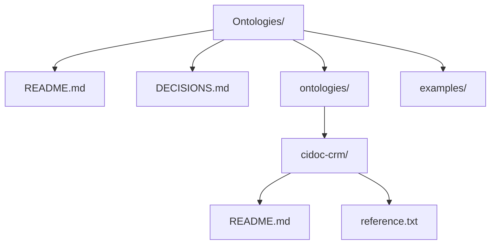

# LOD-AM/Ontologies

**Ontology-related artifacts for the Linked Open Data for Ancient Metallurgy (LOD-AM) knowledge graph.**

## Structure

## Purpose

This repository stores **only ontology-related information** for LOD-AM:
- Which ontologies we use (CIDOC CRM, FRBRoo, Allotrope Framework)
- Why we chose them
- How we use them together
- Example data and SPARQL queries

## Quickstart

1. **Read [DECISIONS.md](./DECISIONS.md)** for the rationale behind our ontology choices.
2. **Browse [ontologies/](./ontologies/)** for per-ontology usage notes.
3. **See [examples/lod-am-example.ttl](./examples/lod-am-example.ttl)** for a complete example.
4. **Use [queries/](./queries/)** for common SPARQL patterns.

## Official Ontologies

We reference external ontologies. Do not commit their full TTL files here:
- **CIDOC CRM**: https://cidoc-crm.org/rdfs/7.1.3/
- **FRBRoo**: http://iflastandards.info/ns/fr/frbr/frbroo/
- **Allotrope Framework (AFO)**: http://www.allotrope.org/ontologies/result#